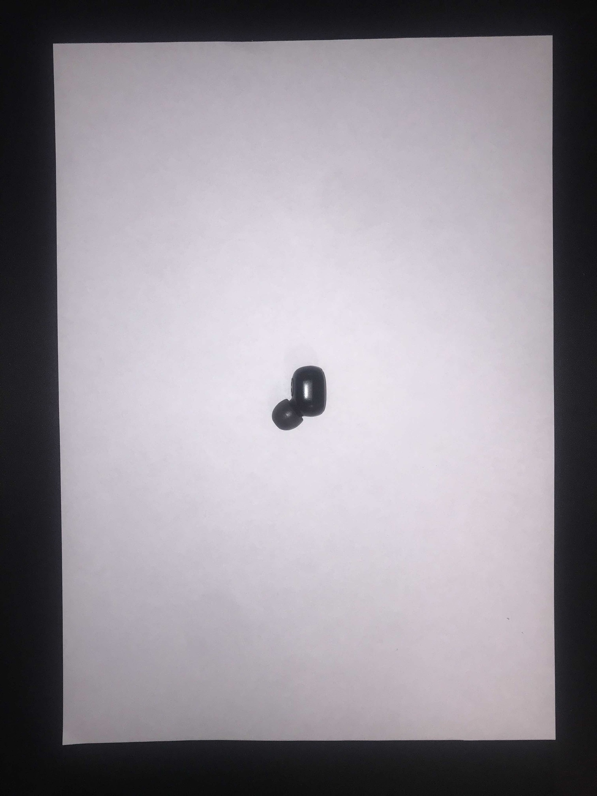
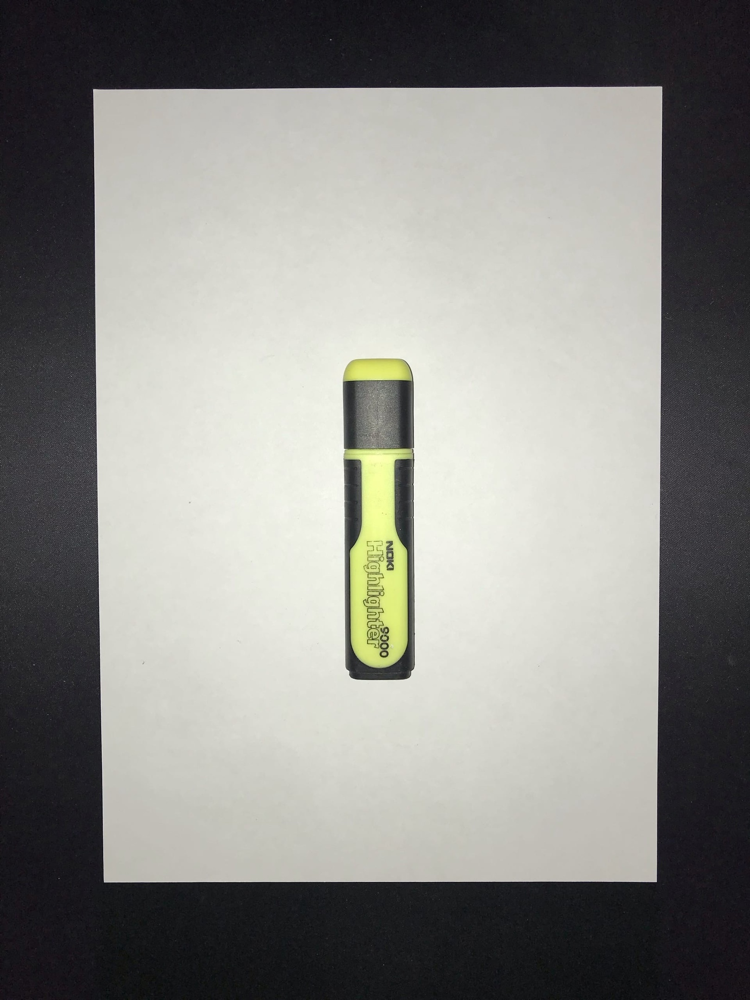

# Intelligent Placer
## Постановка задачи
Требуется по поданной на вход фотографии нескольких предметов на светлой горизонтальной поверхности и многоугольнику определить, какие предметы можно вписать в многоугольник до его наибольшего заполнения. Предметы и горизонтальная поверхность, которые могут оказаться на фотографии, заранее известны. Также заранее известно направление вертикальной оси Z у этих предметов. Многоугольник задаётся фигурой, нарисованной темным маркером на белом листе бумаги, сфотографированной вместе с предметами. “Intelligent Placer” должен быть оформлен в виде python-библиотеки intelligent_placer_lib, которая поставляется каталогом intelligent_placer_lib с файлом intelligent_placer.py, содержащим функцию - точку входа:

```python
def check_image(<path_to_png_jpg_image_on_local_computer>[, <poligon_coordinates>])
```
которая возвращает список индексов вмещаемых предметов (предметы номеруются с 0 сверху вниз относительно фотографии).

```python
from intelligent_placer_lib import intelligent_placer
def test_intelligent_placer():
	assert intelligent_placer.check_image(“/path/to/my/image.png”)
```
Также требуется воспроизводимый intelligent_placer.ipynb, содержащий репрезентативные примеры работы алгоритма с оценками качества его работы и их визуализацией.

### Описание входных данных
- Допустимое разрешение входных фотографий: не менее 1280х1280;
- Высота съемки: не менее 40 см (в общем случае - достаточная для размещения листа А4 и некоторого количества предметов);
- Угол наклона камеры: не более 5 градусов (в идеале 0 дабы избежать нежелательных теней);
- Степень размытости фотографии: фотография должна быть максимально чёткой для беззатруднительного зрительного определения границ предметов, толщина линии границы не более 10 px;
- Допустимые форматы фотографий: png, jpg;
- Размещение предметов: вне листа с многоугольником, вертикально, по одну сторону, без перекрытия, с интервалом ~ 2см между предметами;
- Размещение листа с многоугольником: приблизительно в центре фотографии, ориентация - документ (самая длинная сторона - приблизительно вертикально относительно фотографии);
- Параметры многоугольника: нарисован тёмным маркером (ручкой) на белом листе формата А4, количество вершин - не более 15;
- Параметры фона: предмет (покрытие) сплошного светлого (близкого к белому) цвета;
- Дополнительно: 
  - Несколько экземпляров одного предмета будут расениваться как один предмет;
  - Во избежание возникновения теней рекомендуется воспользоваться несколькими источниками света;

### Описание выходных данных
Список, составленный из индексов вмещаемых предметов. Индексация самих предметов производится сверху вниз относительно фотографии.

### Решаемые задачи
1. Задача определения многоугольника
2. Задача определения предмета
3. Задача укладки (иными словами, наиболее эффективное с точки зрения постановки задачи расположение предметов в многоугольнике)

В первую задачу входит определение многоугольника на заданной фотографии и создание его программной модели по найденным параметрам.
Вторая задача включает в себя обнаружение предметов, определение их параметров с последующим созданием модели.
Отдельно в мини-задачу можно отнести различие многоугольника и предмета. В процессе разработки алгоритма данный момент будет рассмотрен более детально, в последствии этот пункт будет дополнен непосредственно в плане.
Третья задача по сути основная - разработка алгоритма, позволяющего при произвольном входе, удовлетворяющем требованиям, выдать список помещающихся предметов наибольшей суммарной площади.

## Сбор данных
### Рассматриваемые объекты
#### Значок

#### Брелок

#### Деталь кубика рубика

#### Беспроводной наушник

#### Текстовыделитель

#### Медиатор

#### Карандаш

#### Отвертка

#### Игрушечная пуля

#### Жетон

#### Поверхность съемки


### Примеры
#### Пример 1
##### Вход: 

##### Ожидаемый выход:
```python
[0]
```
##### Комментарий:
Тривиальный пример, 1 предмет, помещающийся в заданный многоугольник. Рассматривается ситуация, когда укладывается 1 из 1 предметов.

#### Пример 2
##### Вход: 

##### Ожидаемый выход:
```python
[]
```
##### Комментарий:
Тривиальный пример, 1 предмет, непомещающийся в заданный многоугольник. Рассматривается ситуация, когда укладывается 0 из 1 предметов.

#### Пример 3
##### Вход: 

##### Ожидаемый выход:
```python
[1]
```
##### Комментарий:
2 предмета, только 1 из которых укладывается в заданный многоугольник. Рассматривается ситуация, когда укладывается 1 из 2 предметов.

#### Пример 4
##### Вход: 

##### Ожидаемый выход:
```python
[1]
```
##### Комментарий:
2 предмета, оба по отдельности укладываются в заданный многоугольник. Рассматривается ситуация, когда укладывается 2 из 2 предметов, однако выбор падает на объект с наибольшей площадью.

#### Пример 5
##### Вход: 

##### Ожидаемый выход:
```python
[]
```
##### Комментарий:
0 предметов, краевой случай с пустым (в смысле наличия предметов) входом.

#### Пример 6
##### Вход: 

##### Ожидаемый выход:
```python
[1, 2]
```
##### Комментарий:
3 предмета, все отдельности укладываются в заданный многоугольник. Рассматривается ситуация, когда укладывается 3 из 3 предметов, однако выбор падает на объекты 1 и 2, так как они оба помещаются, и их суммарная площадь больше объкта 0.

#### Пример 7
##### Вход: 

##### Ожидаемый выход:
```python
[0, 1]
```
##### Комментарий:
2 предмета, оба отдельности укладываются в заданный многоугольник. Рассматривается ситуация, когда укладывается 2 из 2 предметов, причем одновременно.

#### Пример 8
##### Вход: 

##### Ожидаемый выход:
```python
[1, 2]
```
##### Комментарий:
3 одинаковых предмета, все отдельности укладываются в заданный многоугольник. Рассматривается ситуация, когда укладывается 3 из 3 одинаковых предметов, одновременно можно уложить 2 из них.

#### Пример 9
##### Вход: 

##### Ожидаемый выход:
```python
[]
```
##### Комментарий:
N предметов, никакой из них не укладывается в заданный многоугольник. Рассматривается ситуация, когда не укладывается произвольное количество предметов.

#### Пример 10
##### Вход: 

##### Ожидаемый выход:
```python
[0, 1, 2, 3]
```
##### Комментарий:
N предметов, все по отдельности и вместе укладывается в заданный многоугольник. Рассматривается ситуация, когда одновременно укладывается произвольное количество предметов.

#### Пример 11
##### Вход: 

##### Ожидаемый выход:
```python
[0, 1]
```
##### Комментарий:
Пример аналогичен предыдущему - N предметов, все по отдельности и вместе укладывается в заданный многоугольник. Рассматривается ситуация, когда одновременно укладывается произвольное количество предметов.

## План работы
Работу над данным проектом разделена на следующие этапы:
- Определение рабочей области - фрагмента изображения, на котором расположены непосредственно многоугольник и объекты на светлом фоне, излишние детали фона обрезаны;
- Выделение структурных элементов - многоугольника и объектов, притом каждый элемент представлен на своём отдельном изображении
- Представление объектов и прямоугольника в виде бинарной маски;
- Разделение объектов и многоугольника в соответсвтующие контейнеры;
- Размещение объектов внутри многоугольника (В РАЗРАБОТКЕ);
- Вывод результатов (В РАЗРАБОТКЕ);

## Пример работы
Чтобы ознакомиться с примерами работы, просмотрите intelligent_placer.ipynb
